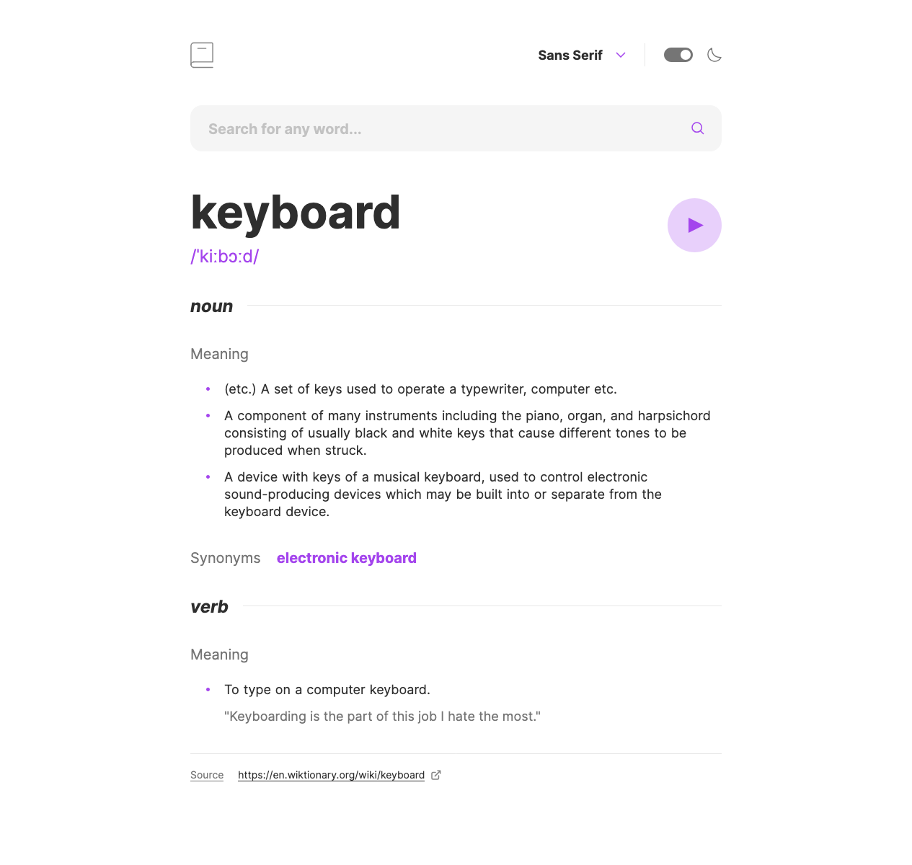

# Dictionary web app solution

This is a solution to the [Dictionary web app challenge on Frontend Mentor](https://www.frontendmentor.io/challenges/dictionary-web-app-h5wwnyuKFL). Frontend Mentor challenges help you improve your coding skills by building realistic projects.

## About the Project

The "Dictionary Web App" challenge was an exploration into crafting a web application that mimics the component-based architecture of React, but using vanilla JavaScript with DOM manipulation techniques.

Built with Vite for a rapid development cycle and styled with Scss for elegance, this project leverages the Dictionary API to fetch word definitions.

A custom state management system was implemented to handle the application's data flow, drawing inspiration from Redux but tailored to a more fundamental approach.

This web app not only serves as a functional dictionary but also as a showcase of how traditional web technologies can be pushed to emulate modern frameworks' capabilities.

## Preview and Links

<b>Open Preview</b>

 

 

| View app live: | [Live Demo URL](https://ionstici.github.io/dictionary-web-app) | [Frontend Mentor](https://www.frontendmentor.io/solutions/dictionary-web-app-Ji-SfmA06-) |
| -------------- | -------------------------------------------------------------- | ---------------------------------------------------------------------------------------- |

## Features

- **Theme Switching:** Users can toggle between _light and dark themes_ for a personalized experience.
- **Font Selection:** Choose from _Sans Serif, Serif, or Mono_ fonts to customize readability.
- **Accessibility:** Fully _keyboard-navigable_, ensuring an inclusive user experience.
- **Audio Pronunciation:** When available, listen to the pronunciation of searched words.
- **Rich Word Data Display:** Presents comprehensive information including definitions, examples, and more in a user-friendly format.
- **Interactive Search:** Click on any word within the displayed data to instantly search for its definition, enhancing user interaction.

## Built with

- **`Vite`:** For an optimized development workflow, providing quick builds and hot module replacement.
- **`Scss`:** For styling, allowing for a structured and modular approach to CSS.
- **Custom DOM Manipulation:** Employed to construct the UI, simulating React's component-based structure.
- **Custom Store:** A basic state management solution to manage word data, akin to a lightweight Redux implementation.
- **Dictionary API:** To retrieve word definitions and related information.

## Deployment

This project is hosted on [**GitHub Pages**](https://pages.github.com), demonstrating that even with a simple setup, modern web apps can be effectively deployed.

## Acknowledgements

Special thanks to [**Frontend Mentor**](http://frontendmentor.io) for the challenge, and to the creators of the [**Dictionary API**](https://dictionaryapi.dev) for enabling access to extensive lexical data.

## License

This project is licensed under the MIT License. See [LICENSE](./LICENSE) file for more information.

## Contact

- [ionStici | GitHub](https://github.com/ionStici)
- [Ion Stici | LinkedIn](https://www.linkedin.com/in/ionstici/)

Feel free to reach out if you have any questions or suggestions!
